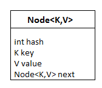

# Hierarchy of Hashmap


# Syntax: Declaration
```
public class HashMap<K,V> 
              extends AbstractMap<K,V>
              implements Map<K,V>, 
              Cloneable, Serializable
```
The direct subclasses are LinkedHashMap, PrinterStateReasons

# Parameters
- K: Type of keys maintained by this map
- V: The type of mapped values


# Constructors

###  1. HashMap()
#### Syntax
```java
    HashMap<K, V> hm = new HashMap<K, V>();
```

### 2. HashMap(int initialCapacity)
#### Syntax
```java
    HashMap<K, V> hm = new HashMap<K, V>(int initialCapacity);
```

### 3. HashMap(int initialCapacity, float loadFactor)
#### Syntax
```java
    HashMap<K, V> hm - new HashMap<K, V>(int initialCapacity, float loadFactor)
```

### 4. HashMap(Map map)
#### Syntax
```java
    HashMap<K, V> hm = new HashMap<K, V>(Map map);
```

# Operations

### 1. Adding
It can be done by add an element to the map using the `put()` method.\
However, the insertion order is not retained in the HashMap.\
Internally, for every element, a separate hash is generated\
and the elements are indexed based on this hash to make it more efficient.

### 2. Changing
It can be done by adding the element with the `put()` method.\
Since the elements in the map are indexed using the keys,\
the value of the key can be changed by simply inserting the\
updated value for the key for which we wish to change.

### 3. Deleting
It can be done using the `remove()` method.\
This method takes the key value and removes\
the mapping for a key from this map if it is\
present in the map.

### 4. Traversal
It can be done by using the Iterator interface.\
Since Iterators work with one type of data we use `Entry<?,?>`\
to resolve the two separate types into a compatible format.\
Then using the `next()` method we print the entries of the HashMap.

# Hashing
A technique of converting a large String to small String that represents the same String

# Features
- HashMap is a part of the `java.util` package
- Extends an abstract class `AbstractMap` which also provides an incomplete implementation of the `Map` interface
- Also implements `Cloneable` and `Serializable` interface. 
- Does not allow duplicate keys but allows duplicate values.
- `Allows null key` but only `once` and `multiple null values`.
- This class makes no guarantees as to the order of the map.
- It does not guarantee that the order will remain constant over time.

# Internal Structure
Internally HashMap contains an array of `Nodes` and a node is represented as a class that contains 4 fields:
1. int hash
2. K key
3. V value
4. Node next

Can be seen that the node is containing a reference to its own object (Linked list).

#### HashMap


#### Node



# Performance
Performance of HashMap depends on 2 parameters:
  1. Initial Capacity
  2. Load Factor / Fill Ratio

### Initial Capacity
  - Capacity of the HashMap at the time of its creation. 
  - In Java, it is 2^6 = 16, meaning it can hold `16 key-value` pairs.

### Load Factor
  - Percent value of the capacity after which the capacity of HashMap is to be increased.
  - In Java, it is 0.75f by default, meaning the rehashing takes place after filling `75% of its capacity`.

### Threshold
  - Product of Load Factor and Initial capacity
  - In Java, by default, 16 * 0.75 = 12, meaning the rehashing takes place after inserting `12 key-value pairs`.

### Rehashing
  - Process of doubling the capacity of the HashMap after it reaches its Threshold.
  - In Java, HashMap continues to rehash (by default) in the following sequence:
    - 2^4, 2^5, 2^6, 2^7, ...

If the initial capacity is kept higher, then rehashing will never be done.\
But by keeping it higher increases the time complexity of iteration.\
The expected number of values should be taken into account to set the initial capacity.


# Synchronized HashMap
[//]: # (TODO)

# Time Complexity
- Constant time complexity for basic operations `O(1)`.
- Iteration / Traversing is directly proportional to the `capacity + size`.

# Applications of HashMap
- Used when we need efficient implementation of search, insert and delete operations
- Examples:
  - Message Digest
  - Password Verification
  - Data Structures
  - Compiler Operation
  - Rabin-Karp Algorithm
  - Linking File name and path together
  - Game Boards
  - Graphics

# Methods
[//]: # (TODO)

# References
[GeeksForGeeks](https://www.geeksforgeeks.org/java-util-hashmap-in-java-with-examples/) \