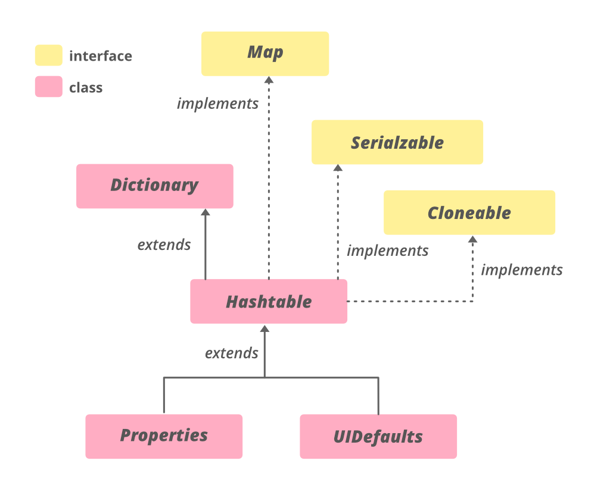
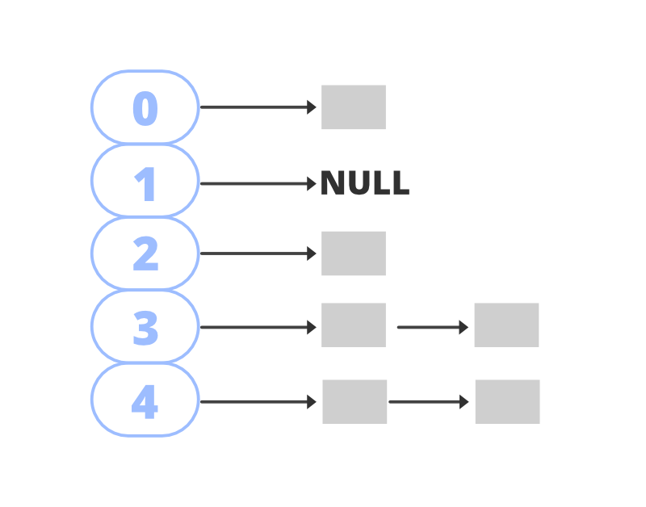

# HashTable

The `HashTable class` implements a hash table, which maps keys to values.
Any non-null object can be used as a key or as a value. To successfully 
store and retrieve objects from a hashtable, the objects used as keys
must implement the hashCode method and the equals method.

# Hierarchy of HashTable


# Syntax: Declaration
```
public class Hashtable<K,V> 
        extends Dictionary<K,V> 
        implements Map<K,V>, 
        Cloneable, Serializable
```
Hashtable implements `Serializable`, `Cloneable`,
`Map<K,V> interfaces` and `extends Dictionary<K,V>`.

The direct subclasses are `Properties` and `UIDefaults`.

# Parameters
- K: Type of keys maintained by this map
- V: The type of mapped values


# Constructors

###  1. Hashtable()
#### Syntax
```java
    Hashtable<K,V> ht = new Hasthable<K,V>();
```

### 2. Hashtable(int initialCapacity)
#### Syntax
```java
    Hashtable<K, V> ht = new Hashtable<K, V>(int initialCapacity);
```

### 3. Hashtable(int initialCapacity, float loadFactor)
#### Syntax
```java
    Hashtable<K, V> ht - new Hashtable<K, V>(int initialCapacity, float loadFactor)
```

### 4. Hashtable(Map map)
#### Syntax
```java
    Hashtable<K, V> ht = new Hashtable<K, V>(Map map);
```

# Operations

### 1. Adding
It can be done by add an element to the map using the `put()` method.\
However, the insertion order is not retained in the Hashtable.\
Internally, for every element, a separate hash is generated\
and the elements are indexed based on this hash to make it more efficient.

### 2. Changing
It can be done by adding the element with the `put()` method.\
Since the elements in the table are indexed using the keys,\
the value of the key can be changed by simply inserting the\
updated value for the key for which we wish to change.

### 3. Deleting
It can be done using the `remove()` method.\
This method takes the key value and removes\
the mapping for a key from this map if it is\
present in the table.

### 4. Traversal
To iterate the table, we can make use of an `advanced for loop`.

# Hashing
A technique of converting a large String to small String that represents the same String

# Features
- Similar to `HashMap` but is synchronized.
- Stores `key/value` pair in a hashtable.
- In Hashtable, we specify an object that is used as a key, and the value we want to \
  associate to that key. The key is then hashed, and the resulting hash code is used \
  as the index at which the value is stored within the table.
- `Does not allow null keys`.
- The `initial default capacity` of hashtable class is `11` whereas `load factor` is `0.75`.
- HashMap `doesn't provide any enumeration`, while Hashtable `provides not fail-fast enumeration`.

# Internal Structure
Hashtable data structure is an array of buckets with stores the key/value pairs in them. \
It makes use of `hashCode()` to determine which bucket the key/value pair should map. \
The hash function helps to determine the location for a given key in the bucket list. \
Generally, hashcode is a non-negative integer that is equal for equal Objects and may \
or may not be equal for unequal Objects. To determine whether two objects are equal or not, \
hashtable makes use of the `equals()` method. \ 

It is possible that two unequal Objects have the same hashcode. This is called `collision`. \
To resolve collisions, `hashtable uses an array of lists`. The pairs mapped to a single bucket \
(array index) are stored in a list and list reference is stored in the array index.

#### Hashtable


# Time Complexity
- Constant time complexity for basic operations `O(1)`.
- Iteration / Traversing is directly proportional to the `capacity + size`.

# Applications of HashMap
- Used when we need efficient implementation of search, insert and delete operations
- Examples:
    - Message Digest
    - File System
    - Password Verification
    - Pattern Matching (e.g., Rabin-Karp Algorithm)
    - Programming Language
    - Compilers

# Methods
[//]: # (TODO)

# References
[GeeksForGeeks](https://www.geeksforgeeks.org/hashtable-in-java/) \
[AfterAcademy](https://afteracademy.com/blog/applications-of-hash-table)